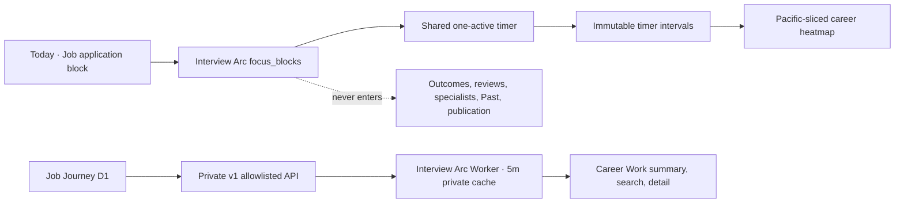

# Postmortem: Career work had no safe domain boundary

**Date:** 2026-07-27  
**Status:** In review — implementation complete, paired production integration pending  
**Verification lane:** Reliability  
**Issue:** [interview-arc#94](https://github.com/Vinosaamaa/interview-arc/issues/94)  
**Paired issue:** [job-journey#49](https://github.com/Vinosaamaa/job-journey/issues/49)

## Summary

Interview Arc modeled all Today work as interview-practice activities. Adding
job applications through that model would have falsely required a problem,
outcome, review, specialist transcript, solution, and publication artifact.
Reading Job Journey's broad dashboard response would also have transferred job
descriptions, notes, cover letters, prompts, and operational telemetry that
Career Work does not need.

This was detected during design, before a production Career Work feature
existed. It is treated as Reliability work because an incorrect implementation
could corrupt practice statistics or expose private application data.

## User impact

Before this change, the user could not:

- reserve and honestly record a job-application focus block;
- compare career focus time in Journey;
- view a small application pipeline summary beside that focus evidence; or
- search a privacy-minimized read-only job list in Interview Arc.

Attempting to reuse a normal specialty would have polluted Past, Problem Bank,
review scheduling, and publication.

## Root cause

The application had only one work-item abstraction: a publishable interview
practice activity. It lacked a broader workbench-owned focus concept and lacked
a least-privilege integration contract with Job Journey.

## Contributing factors

- Activity timers and practice outcomes were coupled at finish time.
- Journey's heatmap assumed every square represented completed practice.
- Job Journey's existing dashboard payload was intentionally broad.
- No server-to-server cache or unavailable state existed for a second private
  application.
- Browser-side integration would have exposed credentials or required unsafe
  CORS.

## Resolution

Implemented safeguards:

- Dedicated `focus_blocks` D1 table.
- Server-verified focus timer path that skips Voice, outcomes, reviews, and
  publication.
- Shared one-active-stopwatch enforcement across practice and focus.
- Pacific-midnight interval splitting and approved time-based heat levels.
- Separate Journey category selector and Career Work panel.
- Explicit Job Journey v1 normalizers that strip every unapproved field.
- Worker-only credential, five-minute private cache, stale fallback, and
  truthful unavailable state.
- Untouched edit/remove lifecycle and completed-block locking.
- Local analytics remain available when Job Journey fails.

## Verification completed

- Contract unit tests cover Pacific midnight, heat thresholds, summary
  semantics, status validation, and response-field allowlisting.
- Local D1 migration applied successfully.
- A real local focus block was created, started, and finished without an
  outcome.
- D1 confirmed the completed focus timer had zero outcome rows and zero
  publication rows.
- The local Career Work endpoint returned focus metrics while Job Journey was
  unavailable.
- Production build completed.

## Remaining verification

- Merge and deploy Interview Arc.
- Deploy Job Journey #49 first and configure the Interview Arc Worker secrets.
- Verify authorized summary/job reads and unauthorized rejection in
  production.
- Verify stale-cache and unavailable behavior without exposing the token.
- Verify the deployed desktop and narrow-screen layouts.
- Keep both issues open until the paired live read succeeds.

## Prevention

| Action | Owner | Tracking | Status |
| --- | --- | --- | --- |
| Document focus versus practice domain boundary | Interview Arc | #94 | Implemented |
| Enforce dedicated D1 model and result-free timer path | Interview Arc | #94 | Implemented |
| Expose allowlisted read-only v1 API | Job Journey | #49 | In progress |
| Add contract fixtures and privacy projection tests | Both repositories | #94 / #49 | Implemented in Interview Arc; paired work pending |
| Require live paired verification before closure | Both repositories | #94 / #49 | Pending |

