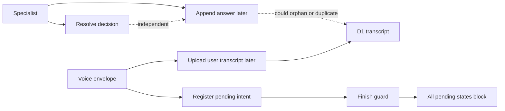
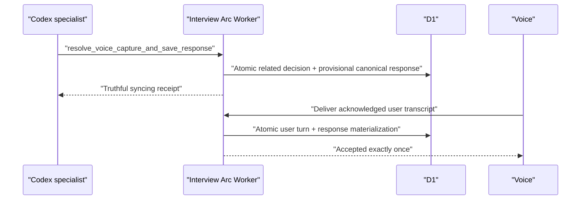

# Postmortem: Practice exchanges could drift, duplicate, or block completion

**Date:** 2026-07-27  
**Status:** In review — implementation complete, production verification pending  
**Verification lane:** Reliability  
**Issue:** [interview-arc#93](https://github.com/Vinosaamaa/interview-arc/issues/93)

## Summary

Interview Arc saved Voice decisions, Voice user transcripts, and specialist
answers through separate operations. Typed questions and answers were also
buffered for later multi-turn flushes. These designs allowed several unsafe
partial states: a related Voice decision without its answer, a provisional
answer without its user turn, a duplicate answer after replaying the same
envelope, or an untouched pending capture that blocked Finish indefinitely.

No confirmed production data-loss count is available. The defect was detected
through user workflow analysis and source inspection before a known published
artifact was proven corrupt. The architecture nevertheless allowed silent
omission, duplication, and invisible completion blockers, so it is treated as
a Reliability incident.

## User impact

- A specialist answer visible in Codex could be absent from the durable draft.
- Replaying one Voice envelope could generate more than one answer.
- A stable transcript turn could be overwritten with different content.
- A deleted or never-submitted local capture could remain `pending` and block
  Finish or publication.
- Local 24-hour cleanup could remove the recovery surface while leaving a
  nonterminal server intent.
- Receipts did not consistently tell the user whether evidence was saved,
  excluded, duplicated, uncertain, or still syncing.

## Detection and evidence

The issue was detected during an end-to-end review of Voice v2 decision,
delivery, specialist flushing, completion, and publication behavior.

Confirmed source evidence:

- `resolve_voice_capture` and transcript append were independent MCP calls.
- `append_practice_transcript` used last-write-wins conflict handling.
- `unresolvedVoiceCaptureCount` treated every `pending` intent as a hard
  blocker.
- Voice user delivery materialized only the user turn; there was no canonical
  `replyToTurnId` response reservation.
- Local expiry had no authoritative server terminalization endpoint.

## Architecture before repair

## Root cause

The primary root cause was that the unit of durability was a transcript turn or
decision, while the user-visible unit was an exchange. The system had no
transactional invariant tying:

1. one Voice decision;
2. one Voice user turn;
3. one canonical specialist response; and
4. their stable ordering.

For typed interaction, the system similarly treated later batch flushing as
the normal persistence path instead of saving one user/answer pair.

## Contributing factors

- Stable IDs were used for lookup but conflicting retries could still overwrite
  stored turn content.
- `pending` was interpreted as evidence observed by a specialist, although it
  proved only that Voice registered an envelope.
- Completion used a count rather than status-specific policy.
- Visible success receipts were not coupled to acknowledged authoritative
  writes.
- Local retention and server terminal state were not one fenced lifecycle.
- Legacy compatibility paths obscured which operation was authoritative.

## Resolution

The repair changes the durability boundary from an individual mutation to one
canonical practice exchange.

Implemented safeguards:

- `save_practice_exchange` stores a typed user/answer pair atomically.
- `resolve_voice_capture_and_save_response` atomically records a related Voice
  decision and reserves one canonical specialist response.
- D1 holds that response provisionally until Voice delivers the matching user
  transcript, then materializes the ordered pair in one batch.
- Exact retries reuse stored results; changed stable identities or bodies are
  rejected and quarantined rather than overwritten.
- Untouched pending captures become `discarded_unclassified` during Finish and
  do not block.
- `uncertain`, confirmed-but-undelivered, deletion, and conflict states return
  distinct recovery instructions.
- `/voice/intents/:captureId/expire` records `expired_unclassified` before the
  native app may delete local evidence.
- Finish and publication verify the canonical materialized user/specialist pair
  rather than accepting an intent status alone.
- A related capture cannot finish until its D1 audio row is `available`, which
  is written only after the private R2 put succeeds. The guard never performs
  an R2 object read.
- If the retained local recording is irrecoverably missing or unreadable,
  Voice reports a privacy-safe `audio_lost` state. Finish remains blocked until
  the user acknowledges that incident; publication renders **Recording
  unavailable** and cannot invent playback or Delivery Coach evidence.
- The server rejects an `audio_lost` report when the clip is already
  `available`, fencing the R2-upload/local-cleanup race in favor of durable
  evidence.
- Specialist contracts require one visible acknowledged receipt per exchange;
  receipts remain outside durable and published content.
- MCP Worker registration and both Codex allowlists are validated in order.

## Verification

Completed locally:

- Cloudflare production build.
- 60 automated tests, including exact identity, finish policy, receipt copy,
  MCP allowlist alignment, Voice v2 gates, and existing reliability coverage.
- ESLint with no errors; three pre-existing warnings remain.
- Local D1 migration `0015_mature_meggan.sql` applied successfully.
- MCP configuration validation confirmed all registered tools are exposed.

Still required before closing the issue:

- Merge and deploy the Worker and D1 migration.
- Reconnect long-lived Codex tasks so the new MCP catalog loads.
- Verify tool discovery and one typed exchange in production.
- Verify related Voice decision, provisional response, user delivery, duplicate
  replay, Finish with untouched pending, uncertain recovery, and expiry.
- Complete the paired native Voice release work for local expiry and recovery
  surfaces.
- Verify accepted delivery cannot finish before both canonical transcript
  turns and D1 `available` audio evidence exist, including session and
  workbench completion.
- Verify acknowledged `audio_lost` is rendered without a player or fabricated
  Delivery Coach evidence.

### 2026-08-02 deletion-graph follow-up

Production cleanup after the exactly-once verification found that deleting an
accepted related capture removed its user turn and private audio, but left the
materialized canonical specialist turn in D1. The deletion implementation
selected only `intent.turnId`; it marked the response reservation discarded
without deleting either the response row or `responseTurnId` transcript row.

The repair derives the complete canonical turn set from the owner-scoped
specialist response, deletes both turns plus the response reservation, and
retains only the terminal capture-intent tombstone needed for idempotent
deletion. Regression coverage requires a related capture to yield both turn
IDs and an unrelated or unresolved capture to yield only its user turn ID.
Merged-release verification must show zero transcript turns and zero audio
clips after deleting the related fixture.

Review of that repair found two adjacent invariants that also needed database
enforcement. A delivery that had already read an accepted intent could race a
concurrent delete and recreate transcript rows, and `response_turn_id` was
indexed but not owner-unique. Commits now insert transcript rows through the
current committable intent predicate inside one D1 batch and verify the final
accepted state before reporting success. Migration `0019` makes each
specialist response turn ID unique per owner, proving that deletion of the
canonical response cannot remove another capture's answer.

### 2026-08-03 specialist-remediation follow-up

**Follow-up issue:** [interview-arc#149](https://github.com/Vinosaamaa/interview-arc/issues/149)

The complete accepted-capture deletion graph was deployed and verified through
the Voice REST flow, but the specialist MCP catalog exposed only pending
classification. A specialist could therefore identify an already-related
administrative capture as contamination without having an owner-authorized,
identity-bound way to invoke the proven deletion transaction. The gap did not
require a second deletion implementation; it required a safe MCP boundary.

The follow-up adds `delete_related_voice_capture`. It requires the exact
capture, activity, and turn IDs plus explicit user authorization and a reason,
is marked destructive in MCP metadata, rejects pending/unrelated/uncertain or
mismatched identities before mutation, and reuses the existing fenced D1/R2
graph deletion. Exact retries against the retained deleted tombstone are
idempotent. Pending administrative captures continue through the
non-destructive `unrelated` decision path.

## Prevention and follow-up

| Action | Owner | Tracking | Status |
| --- | --- | --- | --- |
| Enforce atomic typed and Voice exchanges | Interview Arc | #93 | Implemented locally |
| Validate Worker tool catalog against both allowlists | Interview Arc | #93 | Implemented locally |
| Add authoritative unclassified-expiry endpoint | Interview Arc | #93 | Implemented locally |
| Make native expiry wait for server acknowledgement | Arc Voice | #64 | Paired dependency |
| Require canonical D1 pair plus durable private audio at Finish/publication | Interview Arc | #93 | Implemented locally; production verification pending |
| Keep every open-workbench linked capture actionable until authoritative resolution | Arc Voice | #64 | Implemented locally; packaged verification pending |
| Add explicit acknowledged `audio_lost` terminal state | Interview Arc + Arc Voice | #93 / #64 | Implemented locally; release verification pending |
| Keep Insert Again idempotent and visibly recoverable | Arc Voice | #68 | Paired dependency |
| Preserve status-first bounded reconciliation | Arc Voice | #72 | Paired dependency |
| Delete the complete canonical Voice graph while retaining the intent tombstone | Interview Arc | #125 | Implemented after production cleanup found an orphan specialist turn |

## Technical glossary

- **Canonical response:** The one durable specialist answer associated with a
  stable user turn.
- **Identity-idempotent:** An exact retry returns the existing result; a retry
  with changed immutable identity is rejected.
- **Materialized pair:** The user turn and specialist response are visible
  together to transcript readers and publication.
- **Provisional response:** A reserved answer held in D1 but not visible until
  the matching Voice user turn arrives.
- **Terminal intent:** A capture state that requires no later decision and
  cannot block completion.
- **Tombstone:** Durable evidence that a record was intentionally discarded or
  deleted, preventing a late retry from recreating it silently.
