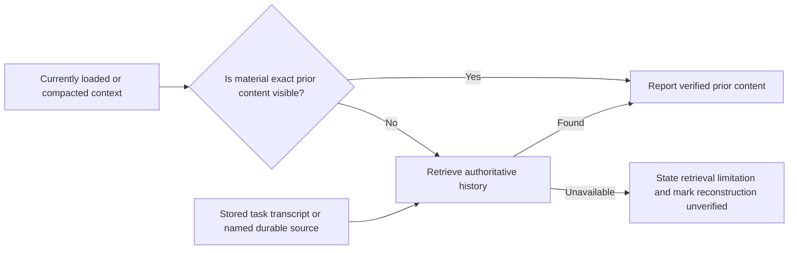

# Postmortem: Unverified reconstruction was reported as prior task content

- **Date:** 2026-08-09
- **Status:** Remediation applied; postmortem in review
- **Verification lane:** Reliability
- **Issue:** [interview-arc#203](https://github.com/Vinosaamaa/interview-arc/issues/203)
- **Superseded PR:** [interview-arc#204](https://github.com/Vinosaamaa/interview-arc/pull/204)

## Summary

In a long-lived task, the user asked for the exact skill recommendations that
had been given earlier. The original response was no longer present in the
agent's currently loaded context, but it remained available in the stored task
transcript. The agent did not retrieve that transcript. It supplied a
plausible but different reconstruction and then incorrectly said the original
response had not been durably recorded.

The user detected the mismatch. A later transcript query recovered the exact
original response and confirmed that it had been stored. No practice activity,
D1 record, publication artifact, or source file was mutated by the incorrect
answer.

The first remediation draft placed a detailed rule in Interview Arc's root
guide. Before merge, the user clarified that the behavior must apply to every
local Codex project. The repository rule was removed and replaced by one
concise rule in the machine-wide Codex guide.

## Impact

- The user received incorrect attribution about what the agent had previously
  recommended.
- The answer incorrectly described durable task history as missing.
- The user had to challenge the response before authoritative retrieval
  occurred.
- Continuing from the reconstruction could have changed the planned skill
  design using references the user had not actually approved.
- The incident reduced trust in long-lived-task continuity even though the
  authoritative transcript remained intact.

## Detection

The user recognized that both the reconstructed shortlist and the storage
claim conflicted with the earlier conversation. After that challenge, the
agent queried the stored task transcript, found the original response, and
reported the correction.

## Timeline

1. The original skill-research response was written to the task transcript.
2. Later context compaction left the exact response outside the agent's loaded
   context while preserving it in stored history.
3. The user asked the agent to recall the earlier recommendations.
4. The agent answered from semantic reconstruction rather than retrieving the
   stored transcript.
5. The user rejected the reconstruction and the claim that the response was
   not durably recorded.
6. The agent queried authoritative task history, recovered the exact response,
   and corrected the record.
7. Issue #203 and PR #204 initially proposed a repository-wide retrieval gate.
8. The user clarified that the rule must cover every local Codex project.
9. The unmerged repository rule was removed and the machine-wide guide was
   updated instead.

## Relevant context boundary

Loaded context is a working input, not proof that older task content was never
stored. Absence from that input must not be upgraded into a storage claim.

## Root cause

The immediate cause was an unverified reconstruction presented as historical
fact. The systemic cause was the absence of a machine-wide instruction
requiring agents to distinguish loaded context from authoritative task history
and to retrieve the latter before making material exact claims about prior
content or its storage status.

## Contributing factors

- The task was long-lived and had undergone context compaction.
- Related contemporary skill research made alternative recommendations feel
  plausible even though they were not the original shortlist.
- The phrase "do you remember" was treated as an invitation to answer from
  semantic memory rather than a request for historical verification.
- No shared guide explicitly prohibited claiming that content was missing or
  unsaved before checking authoritative storage.

## Failed approaches

- Reconstructing the likely answer from current context produced a coherent
  but historically false response.
- Describing the response as not durably recorded converted an unverified
  retrieval assumption into a false storage claim.
- Correcting only after the user objected put the verification burden on the
  user.

## Resolution

The machine-wide `~/.codex/AGENTS.md` now contains one compact requirement:

> Before reporting material prior dialogue, decisions, identifiers, or saved
> state, verify it against the stored task transcript or owning system of
> record. Never present reconstruction as history or claim content is missing
> or unsaved without checking; if verification is unavailable, say so.

There is no `~/.codex/AGENTS.override.md`, and `CODEX_HOME` is not customized,
so this is the active global guide. Codex loads it before repository and nested
project guidance. Interview Arc's root and specialist guides do not duplicate
the rule. Already-running sessions still need an instruction reload or restart
because the instruction chain is constructed at run or session start.

## Verification

- Confirm the compact rule is present in the active global guide.
- Confirm no global override or custom Codex home shadows that guide.
- Confirm Interview Arc's root and specialist guides do not duplicate it.
- Run Markdown and whitespace checks for the changed files.
- Confirm the pull request is based only on current `origin/main` and contains
  no unrelated work.
- Have each existing long-lived task reload instructions or restart before
  relying on the new global rule.

## Prevention and follow-up

| Action | Owner | Tracking | Status |
| --- | --- | --- | --- |
| Add machine-wide authoritative-history retrieval gate | Local Codex configuration | #203 | Implemented |
| Remove the unmerged repository-specific duplicate | Interview Arc | #204 | Implemented in branch |
| Preserve private task identifiers and transcript paths outside public artifacts | Interview Arc | #203 | Implemented |
| Reload existing long-lived tasks after the global edit | Task coordinator | #203 | Pending reload |
| Consider automated transcript lookup only if instruction-level prevention proves insufficient | Interview Arc | Future evidence | Not currently planned |

## Known limitations

- The rule cannot retrieve history that is genuinely unavailable to the active
  environment.
- It does not add a transcript-search product feature or change D1/MCP.
- It does not make every paraphrase require byte-for-byte lookup; the gate is
  for material exact claims about prior content, decisions, or storage state.
- A project-level instruction can override global guidance if it explicitly
  conflicts; no such Interview Arc override currently exists.
- Existing sessions do not receive a live broadcast of changed instruction
  files and must reload or restart.
