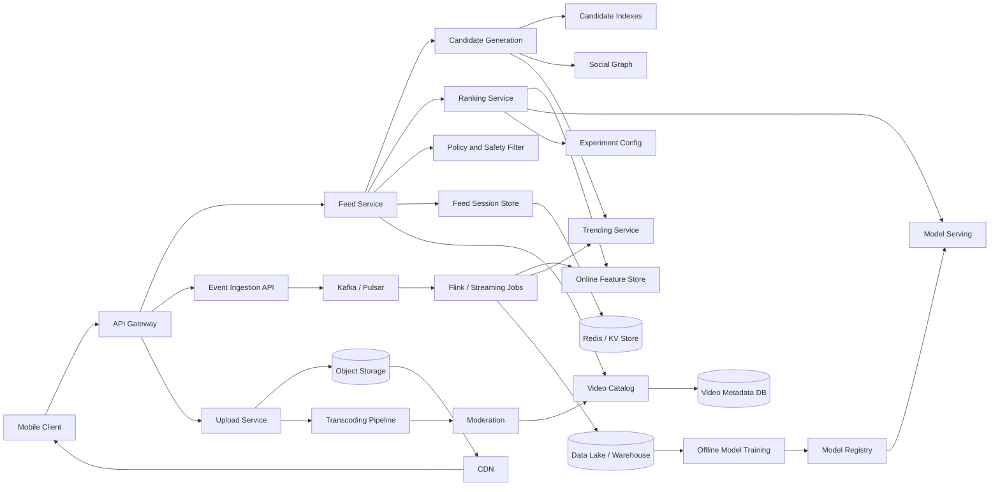

# Design a TikTok-Style For You Feed

## Question

Design the personalized short-video feed for a TikTok-like application.

The interviewer wants to see whether you can separate media delivery from feed personalization, design the online serving path, handle high-volume user events, and explain how real-time feedback updates the feed.

## Short Answer

I would design the feed as a low-latency recommendation serving system backed by a separate video upload and media-delivery pipeline. The client asks for a batch of feed items. The Feed Service gathers candidate videos from multiple retrieval sources, filters unsafe or ineligible items, ranks them using user/video/context features, applies diversity and freshness rules, and returns video metadata plus CDN playback URLs. User interactions are streamed through an event pipeline into real-time feature stores and offline training systems, so the next feed request can adapt quickly to skips, watch time, likes, follows, and reports.

## Clarifying Questions

Ask these first in an interview:

1. Are we designing only the home "For You" feed, or also following feed, search, comments, DMs, and live streaming?
2. Do we need to cover video upload and transcoding, or can we assume videos already exist?
3. What is the target scale: DAU, feed requests per second, video uploads per day, and event volume?
4. What latency matters most: first feed load, next-page fetch, video startup time, or recommendation freshness?
5. Do we need to discuss trust and safety, age restrictions, regional compliance, and creator blocking?

For this answer, scope the system to:

- Personalized For You feed.
- Video metadata and playback URL serving.
- Basic video ingestion pipeline.
- Event collection and feedback loop.
- Not in scope: comments, DMs, live streaming, ads auction, creator analytics, payment systems.

## Requirements

### Functional Requirements

- Users can open the app and receive a personalized list of short videos.
- Users can scroll infinitely and request the next batch with a cursor.
- Feed ranking should react to user actions such as watch time, skip, like, share, follow, dislike, report, and "not interested".
- The system should avoid showing the same video repeatedly.
- The system should filter unavailable, unsafe, blocked, region-restricted, or age-inappropriate videos.
- Creators can upload videos that become eligible for recommendation after processing and moderation.

### Non-Functional Requirements

- Low latency for feed serving: target p95 under 300 ms for metadata ranking response.
- Very low video startup latency through CDN and prefetching.
- High availability: feed should degrade gracefully if ranking or feature dependencies are slow.
- High write throughput for interaction events.
- Strong durability for uploaded video objects and important user actions.
- Near-real-time personalization: user feedback should affect recommendations within seconds to minutes.
- Offline ML training can be eventually consistent.

## Capacity Assumptions

These are interview placeholders; align them with the interviewer.

- 100 million daily active users.
- Each user opens 10 feed sessions per day.
- Each feed page returns 10 to 20 videos.
- Feed requests: 1 billion requests/day, around 12k average QPS and 50k to 100k peak QPS.
- Interaction events: tens of billions/day, potentially hundreds of thousands to millions per second at peak.
- Video uploads: millions/day.

This scale implies:

- Online feed serving must be horizontally scalable.
- Event ingestion must be append-only and streaming-first.
- Video bytes must be served by object storage plus CDN, not by application servers.
- Ranking must have fallbacks, because feature/model dependencies will occasionally be slow.

## High-Level Architecture



## Core APIs

### Get Feed

```http
GET /v1/feed?cursor=abc&page_size=12
Authorization: Bearer <token>
```

Response:

```json
{
  "items": [
    {
      "feed_item_id": "fi_123",
      "video_id": "v_456",
      "creator_id": "u_789",
      "caption": "quick pasta recipe",
      "duration_ms": 17000,
      "playback": {
        "hls_url": "https://cdn.example.com/v_456/master.m3u8",
        "preview_url": "https://cdn.example.com/v_456/preview.jpg"
      },
      "ranking_reason": "recommended",
      "request_id": "req_abc"
    }
  ],
  "next_cursor": "def"
}
```

The response returns metadata and CDN URLs, not the video bytes.

### Send Events

```http
POST /v1/events
```

Example events:

```json
{
  "events": [
    {
      "event_id": "evt_1",
      "user_id": "u_123",
      "video_id": "v_456",
      "feed_item_id": "fi_123",
      "event_type": "watch",
      "watch_ms": 14200,
      "video_duration_ms": 17000,
      "client_ts": 1783552000000
    },
    {
      "event_id": "evt_2",
      "user_id": "u_123",
      "video_id": "v_456",
      "event_type": "like",
      "client_ts": 1783552010000
    }
  ]
}
```

The event API should be idempotent by event_id.

### Upload Video

```http
POST /v1/videos/upload-url
```

Returns a pre-signed object-storage URL so the client can upload directly to object storage.

## Data Model

### User Profile

- user_id
- region, language, age bucket
- blocked creators
- interest embedding
- followed creators
- recent watch history summary
- safety and privacy settings

### Video Metadata

- video_id
- creator_id
- caption, hashtags, audio_id
- duration, dimensions
- language, region availability
- moderation status
- upload timestamp
- engagement counters
- content embedding
- playback renditions

### Feed Session

- request_id
- user_id
- cursor
- shown_video_ids
- candidate_sources
- ranking model version
- experiment bucket

This helps with deduplication, debugging, and experiment analysis.

### Interaction Event

- event_id
- user_id
- video_id
- feed_item_id
- event_type
- watch_ms
- client timestamp
- server timestamp
- device and network context

## Feed Serving Path

### 1. Client Requests Feed

The mobile client calls the Feed API with a cursor and page size. The API Gateway authenticates the user and forwards the request to the Feed Service.

The client should prefetch the next page before the user reaches the end of the current batch. It should also prefetch video manifests or first chunks through the CDN to reduce video startup latency.

### 2. Candidate Generation

The Feed Service asks Candidate Generation for a few hundred to a few thousand candidate videos. Candidate sources can include:

- Similar videos to what the user recently watched.
- Videos from creators the user follows.
- Videos popular in the user's region or language.
- Fresh videos that need exploration.
- Videos from users with similar interests.
- Videos matching inferred topics from embeddings.

Important point: candidate generation optimizes recall. It should find plausible videos quickly, not perfectly rank them.

### 3. Filtering

Before ranking, remove videos the user should not see:

- Already watched or recently shown.
- Blocked creator or blocked by creator.
- Region restricted.
- Age restricted.
- Moderation status not approved.
- Copyright or legal restrictions.
- Duplicates or near-duplicates.
- Content the user explicitly rejected.

Filtering is partly policy-critical, so it should not depend only on a best-effort ML model.

### 4. Feature Fetch

Ranking needs features such as:

- User features: interests, language, region, recent likes/skips, device, session depth.
- Video features: topic embedding, age, duration, creator quality, engagement rates.
- User-video cross features: similarity between user embedding and video embedding, prior creator interactions.
- Context features: time of day, network quality, app version, experiment bucket.

Use an online feature store for low-latency features and a cache for very hot video features.

### 5. Ranking

The Ranking Service scores candidates using model serving. A typical objective combines:

- Probability of long watch.
- Expected watch time.
- Probability of like/share/follow.
- Probability of skip or report as negative signals.
- Creator and content quality signals.

The ranker should not just sort by model score. It should apply business and product constraints:

- Diversity across topics and creators.
- Freshness quotas.
- Exploration quota for new videos or uncertain interests.
- Safety demotion rules.
- Avoid too many similar videos in a row.

### 6. Return Feed Items

The Feed Service stores shown IDs in a session store such as Redis, returns the top N videos, and includes a cursor. The cursor can encode request state or point to state stored server-side.

The response includes video metadata, CDN playback URLs, and tracking IDs for later attribution.

## Video Upload and Processing Path

1. Client requests a pre-signed upload URL.
2. Client uploads video directly to object storage.
3. Upload Service creates a video metadata record with status = processing.
4. Transcoding pipeline creates multiple renditions, thumbnails, and preview clips.
5. Moderation checks content safety, copyright, policy, region, and age restrictions.
6. Feature extraction computes audio, visual, text, and embedding features.
7. Approved videos are added to candidate indexes.
8. CDN serves video bytes globally.

This pipeline is asynchronous. The feed should only recommend videos after required processing and moderation pass.

## Event Pipeline and Feedback Loop

User events are high-volume and should go through an append-only log such as Kafka or Pulsar.

Flow:

1. Client batches events and sends them to Event Ingestion API.
2. Event API validates and writes to Kafka.
3. Stream processing jobs aggregate recent user behavior.
4. Online Feature Store updates user/session features.
5. Trending Service updates regional and global hot lists.
6. Data Lake stores raw events for analytics and offline model training.
7. Training jobs produce new ranking models.
8. Model registry deploys approved models to online serving.

Real-time examples:

- If a user skips three basketball videos quickly, reduce basketball candidates in the next feed page.
- If a user watches cooking videos to completion and follows a cooking creator, increase cooking-related candidates.
- If a video receives many reports, demote it quickly while moderation reviews it.

## Storage Choices

### Object Storage

Use S3/GCS-like object storage for raw and transcoded video files. It is durable and cheap for large blobs.

### CDN

Use CDN for video delivery. App servers should never stream video bytes directly.

### Metadata DB

Use a scalable database for video metadata. Options:

- DynamoDB/Cassandra for massive scale and simple key-value access.
- Spanner/CockroachDB if stronger relational guarantees are needed.
- Elasticsearch/OpenSearch for text search, but not as the primary source of truth.

### Feature Store

Use an online feature store backed by Redis/Cassandra/DynamoDB-like storage for low-latency feature reads.

### Event Log

Use Kafka/Pulsar for event ingestion. Retain events long enough for replay, debugging, and backfills.

### Session Store

Use Redis or another low-latency KV store for recent shown IDs, cursor state, and request/session dedupe.

## Caching Strategy

- CDN caches video bytes and manifests.
- Cache hot video metadata and engagement counters.
- Cache user profile features for the duration of a session.
- Cache candidate lists for anonymous, cold-start, or geography-based feeds.
- Avoid caching fully ranked personalized feeds too aggressively, because real-time feedback should change the ranking.

Good answer nuance: CDN improves playback latency, but it does not solve feed personalization latency.

## Cold Start

### New User

Use:

- Region and language.
- Device and app settings.
- Onboarding interests if available.
- Trending content.
- Diverse exploration.
- Early session signals such as watch time and skips.

### New Video

Use:

- Creator history.
- Caption, hashtags, audio, and visual embeddings.
- Small controlled exploration buckets.
- Early engagement quality, especially watch completion and reports.

Do not rely only on raw like counts, because that creates a rich-get-richer loop.

## Reliability and Degradation

If Candidate Generation is slow:

- Use cached regional trending candidates.
- Use followed creators.
- Use previous candidate lists.

If Ranking Service is slow:

- Fall back to a lightweight ranker.
- Use heuristic ranking based on user interests and trending score.

If Feature Store is slow:

- Use stale cached features.
- Rank with a smaller feature set.

If Event Pipeline is delayed:

- Feed serving continues, but personalization freshness degrades.
- Buffer client events and retry.

Design for graceful degradation because the feed is core to the app.

## Consistency

Most feed data can be eventually consistent:

- Engagement counters can lag.
- Ranking features can lag slightly.
- Offline model updates can happen periodically.

Some data needs stronger guarantees:

- User blocks.
- Safety removals.
- Legal takedowns.
- Age restrictions.
- "Not interested" or explicit content preferences.

These policy-critical filters should be checked in the online serving path or propagated with very low delay.

## Observability

Track:

- Feed request QPS, latency, and error rate.
- Candidate source latency and contribution.
- Ranking latency and model version.
- Video startup latency and rebuffering.
- Event ingestion lag.
- Feature freshness.
- Duplicate shown rate.
- Watch time, skip rate, like/share/follow rates.
- Safety report rate.
- Experiment metrics.

For debugging, store request_id, model version, candidate source, and top ranking features for sampled requests.

## Security, Privacy, and Safety

- Authenticate requests at the gateway.
- Protect pre-signed upload URLs with short TTLs.
- Scan uploads before recommendation eligibility.
- Enforce blocked users and privacy settings.
- Avoid exposing private user features in API responses.
- Apply age, region, copyright, and policy restrictions before ranking.
- Rate-limit upload, event, and feed APIs.
- Make events tamper-resistant enough for abuse detection.

## Tradeoffs

### Precomputed Feed vs Online Ranking

Precomputed feed:

- Lower request latency.
- Easier to serve at scale.
- Less reactive to fresh user feedback.

Online ranking:

- More personalized and adaptive.
- More expensive and dependency-heavy.
- Needs careful fallbacks.

For a TikTok-style feed, use hybrid ranking: precompute candidate pools and features, but do final ranking online.

### Exact Deduplication vs Approximate Deduplication

Exact shown-video history can be expensive at large scale. Use a short-term exact set in Redis and longer-term approximate structures or summarized history for older views.

### Freshness vs Quality

Too much freshness hurts feed quality. Too little freshness prevents new creators from growing. Use controlled exploration quotas.

### Personalization vs Diversity

Pure personalization can trap users in narrow topics. Add diversity constraints and exploration.

## Bottlenecks and Solutions

### Ranking Latency

Problem: Ranking thousands of candidates with many features is expensive.

Solutions:

- Two-stage ranking: lightweight ranker narrows candidates, heavy ranker scores top candidates.
- Cache hot video features.
- Batch feature fetches.
- Use model serving optimized for batch inference.
- Apply timeout budgets per dependency.

### Event Volume

Problem: Watch and scroll events are enormous.

Solutions:

- Batch events on the client.
- Use Kafka/Pulsar partitions by user_id or event_id.
- Separate critical events from analytics-only events.
- Use stream processing for real-time aggregates.
- Store raw events in a data lake for replay.

### Video Delivery

Problem: Video startup latency matters more than feed metadata latency once the user scrolls.

Solutions:

- CDN close to users.
- Adaptive bitrate streaming.
- Client prefetching.
- Small preview assets.
- Multi-rendition transcoding.

## Interview Walkthrough

A strong spoken answer could be:

"I would separate this into three systems: feed serving, media processing, and feedback learning. For a feed request, the client calls the Feed Service. It retrieves candidates from sources like similar videos, followed creators, regional trending, and fresh exploration pools. Then it applies hard filters for safety, blocks, region, age, and already-seen videos. After that, it fetches user, video, and context features and calls the Ranking Service. The ranker scores candidates based on expected watch time, completion, like/share/follow probability, and negative signals like skips or reports. The Feed Service applies diversity and freshness constraints, stores shown IDs in a session store, and returns metadata plus CDN playback URLs.

For video upload, the client uploads to object storage through a pre-signed URL. A processing pipeline transcodes the video, creates thumbnails, runs moderation, extracts features and embeddings, and then makes approved videos eligible in candidate indexes. Video bytes are served through CDN, never through the Feed Service.

For feedback, the client sends watch, skip, like, share, follow, dislike, and report events to an ingestion API. Events go into Kafka. Streaming jobs update the online feature store and trending indexes within seconds or minutes, while offline jobs train new ranking models. If ranking or features are unavailable, the system falls back to cached candidates or a lightweight ranker, because the feed must remain available."

## Common Follow-Up Questions

### How do you prevent showing the same video twice?

Store recent shown video IDs per user/session in Redis. Include feed_item_id in responses and events. For longer history, store compact watch summaries or approximate sets. Filter candidates before ranking.

### How do you handle a sudden viral video?

Events update streaming aggregates. Trending Service adds the video to regional/topic pools. Safety systems monitor reports and abnormal engagement. Candidate Generation can pull from trending pools, while Ranking decides whether the video fits each user.

### How do you make the feed responsive to skips?

Send skip/watch-time events immediately. Streaming jobs update short-term session features. Feed Service reads those features on the next page request. Also maintain in-memory session context for very recent feedback.

### What happens if the ranking model is down?

Use a fallback ranker based on cached user interests, video popularity, freshness, and safety score. Return fewer or simpler recommendations if needed, but keep the app usable.

### Where would you use ML?

- Video and user embeddings.
- Candidate retrieval.
- Ranking score prediction.
- Safety and moderation.
- Spam and abuse detection.
- Exploration strategy.

But the system design answer should focus on service boundaries, latency, data flow, scaling, and failure handling, not only ML model details.

## What Interviewers Want To Hear

- Video bytes are served by CDN; the Feed Service returns metadata and playback URLs.
- Candidate generation and ranking are separate stages.
- Real-time events update online features and trending indexes.
- Offline training improves future model versions.
- Policy and safety filters are hard gates, not just ranking suggestions.
- The system has graceful fallbacks for ranking, features, and candidate retrieval.
- The feed balances personalization, freshness, diversity, and exploration.

## Final One-Minute Summary

"I would build a hybrid online recommendation system. The Feed Service gathers candidates from social, similarity, trending, and exploration sources, filters them through policy and dedupe rules, ranks them with online features and model serving, applies diversity constraints, and returns metadata plus CDN URLs. Uploads go through object storage, transcoding, moderation, and feature extraction before videos enter candidate indexes. User events stream through Kafka into online feature stores for near-real-time personalization and into offline warehouses for model training. The key tradeoff is precomputed speed versus online personalization, so I would precompute candidates and features but rank online with fallbacks."
