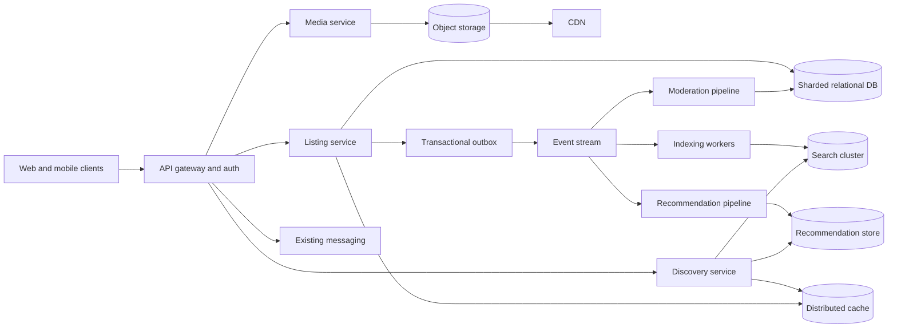

# Build a Marketplace Feature for Facebook

## Pinned Notes

None recorded.

## Prompt and Reference

Build a Marketplace Feature for Facebook

[Open the canonical question](https://systemdesign.io/question/build-a-marketplace-feature-for-facebook)

## Timeline and Attempt Facts

- Session: `2026-07-21-session-1-0-0`
- Started: Jul 22, 2026, 2:55:51 AM PDT
- Finished: Jul 22, 2026, 3:07:31 AM PDT
- Elapsed: 699 seconds
- Allocated: 3600 seconds
- Outcome: `solved_after_reviewing_approach`
- Timing source: `website`
- Transcript scope: `full_activity`

## Summary

This was an introductory coached setup rather than a completed candidate-led design. The user started the mock, candidly requested mentoring when unsure how to clarify scope, and received scope and prioritized-functional-requirements frameworks. The activity ended before the user proposed estimates, APIs, a data model, architecture, flows, reliability, or tradeoffs. A complete original reference design is included for review.

## Full Activity Transcript

### User · Jul 22, 2026, 2:56:21 AM PDT

Yeah, okay, so right now let's start the mock interview. Okay, first you start doing this. Yeah, let's just start the mock interview and I'm ready, okay?

_Source: Voice transcript_

### Specialist · Jul 22, 2026, 2:57:45 AM PDT

Great—let’s begin. Your prompt is: **Build a Marketplace Feature for Facebook.** The activity timer is running. Treat this like a real interview: I’ll let you lead, ask one follow-up at a time, and give hints only if needed.

Start by clarifying the problem. What questions would you ask me to establish the scope and the primary user journeys before you design anything?

_Source: Codex_

### User · Jul 22, 2026, 2:59:03 AM PDT

That's actually a good question. What kind of questions should I ask you to assess your scope and primary? One thing is that we are talking like you are both a mentor and interviewer, right? So I have a little question for you. How do you navigate through these different roles? For example, right now, I actually have no idea how to answer to this question. So, what should we do right now? Should we start like, can you mentor me first? Or what's our approach for this one?

_Source: Voice transcript_

### Specialist · Jul 22, 2026, 2:59:49 AM PDT

Absolutely—we should mentor first. Here’s how I’ll handle the two roles:

- **Interviewer mode:** you lead; I answer clarification questions and probe your decisions.
- **Coach mode:** when you’re unsure, I give a small framework or hint.
- Then we immediately return to interviewer mode so you practice the step yourself.

I’ll use a gradual ladder: **question → hint → short teaching → retry**. Right now you said you have no starting point, so we’re in coach mode.

For scope clarification, don’t design the system yet. Clarify four things:

1. **Users:** Are we serving buyers, sellers, or both?
2. **Core journeys:** Creating a listing, discovering nearby items, viewing details, and contacting a seller?
3. **Boundaries:** Are payment, shipping, and delivery included, or do buyer and seller complete the deal themselves?
4. **Priorities:** Which journey matters most, and what scale or latency should we design for?

You do not need to ask everything at once. A strong first question would be:

> “Should I focus on a local peer-to-peer marketplace where sellers create listings and buyers discover nearby items and contact sellers, while payment and delivery are out of scope?”

Now we switch back to **interviewer mode**. Ask me that first scope question in your own words. It does not need to be perfect.

_Source: Codex_

### User · Jul 22, 2026, 3:01:26 AM PDT

Yeah, okay, just one question. This was a serious question. So right now I'm using, I think, 5.6 so high, right? And I think you are, it's pretty slow for you to answer this kind of questions. Do you think I should switch to another model? Because sometimes you're getting too slow to each question, you know. But I'm not totally trust on all other models, you know. Because for other models, you know, you know what I'm saying. Even for other models, it might not have so much intelligence that would be helpful to our interview and coaching session. What do you think?

_Source: Voice transcript_

### User · Jul 22, 2026, 3:03:55 AM PDT

Okay, where were we just now? So we are starting an interview, mock interview, right? So, yeah, can you give me a little hint to our current question? What should I do? And we're talking about the functional requirements, right? Maybe you can tell me something about the functional requirements?

_Source: Voice transcript_

### Specialist · Jul 22, 2026, 3:05:15 AM PDT

Yes—we’re in the Marketplace mock, and we were moving from scope clarification into functional requirements.

A functional requirement describes what the product must let a user do. For this round, use this working scope: a local peer-to-peer marketplace for buyers and sellers; payment, shipping, and delivery are out of scope.

Start with only three core requirements:

1. A seller can create, edit, and deactivate a listing with a title, description, price, photos, category, and location.
2. A buyer can browse or search for nearby listings and filter the results.
3. A buyer can view a listing’s details and contact the seller.

Recommendations and moderation can be secondary requirements after the core flow. The current prompt also emphasizes listing retrieval, location-based discovery, search, and recommendations: https://systemdesign.io/question/build-a-marketplace-feature-for-facebook

Now switch back to interviewer mode: state the three prioritized functional requirements in your own words. A useful sentence pattern is, “The system should allow users to…”

_Source: Codex_

### User · Jul 22, 2026, 3:05:51 AM PDT

Okay, here is the thing. I accidentally clicked into the lead code agent for the same answer, for the same question. So right now, I'm not sure how all these things worked, but that one is still working on the answer. The lead code agent is still working on the answer. We can continue our answer here, our mock interview right now here. So right now I have a question. Did you look up the solution online first? Did you have the solution already? Because you need to search the website for that, right? Did you already find the solution to this question?

_Source: Voice transcript_

### Specialist · Jul 22, 2026, 3:06:34 AM PDT

Yes. Before starting the mock, I did the required reference preparation:

- I resolved the canonical question and checked D1 for an existing Solution Profile. **No profile exists yet.**
- I attempted to open the stored SystemDesign.io page: https://systemdesign.io/question/build-a-marketplace-feature-for-facebook
- The exact page did not return fully readable content through the browser, so I did not pretend I had read a hidden solution.
- I verified its recommended marketplace references and opened two accessible ones: the Bugfree.ai Craigslist design write-up on Medium and the online-marketplace design cheat sheet on Reddit.

So I do have a private interviewer rubric covering the expected requirements, architecture, flows, scaling issues, and tradeoffs. It is an original synthesis—not a copied “official answer”—and I’ll keep it private while you attempt the design. At finalization, I’ll create the first complete standalone Solution Profile and record only the sources actually consulted.

I also see that another specialist turn has already appeared in this activity’s D1 transcript and moved into functional requirements. That was likely the other task you opened. We can continue here without repeating it, but if that LeetCode task is still running, it’s best to stop it so two tasks do not produce competing system-design coaching turns.

_Source: Codex_

### User · Jul 22, 2026, 3:14:19 AM PDT

Okay, are we still in one activity right now or not? Because I just ended all the activity now. So this might be another test. Alright, and I've ended all my session today. Please publish the artifacts.

_Source: Voice transcript_

## Complete Reference Design

## Problem framing and assumptions

Design the core of a Facebook-style local peer-to-peer marketplace. Sellers create and manage listings; buyers discover nearby items, view details, and contact sellers. Reuse Facebook identity and existing messaging/notification systems. Payments, shipping, delivery, auctions, and advertising are out of scope. All scale numbers below are explicit planning assumptions, not prompt facts.

## Functional requirements

1. Sellers create, edit, publish, mark sold, and deactivate listings with title, description, price, category, photos, condition, and approximate location.
2. Buyers browse and full-text search active nearby listings, filter by category, price, distance, and condition, and paginate results.
3. Buyers view listing details and contact sellers through existing messaging.
4. Users report unsafe listings or sellers; automated and human moderation can reject or hide content.
5. Favorites, personalized recommendations, and notifications are secondary features.

## Non-functional requirements

The workload is read-heavy. Target p95 below 300 ms for discovery and below 200 ms for cached listing details, with 99.9% browse availability. Metadata and media are durable. Ownership and lifecycle mutations are strongly consistent at the source of truth; search, recommendations, caches, and moderation propagation may be eventually consistent within seconds. Protect exact location and personal data, control abuse, and make search rebuildable from canonical storage.

## Scale and capacity estimates

Assume 100M monthly users, 10M daily users, and 100M active listings. At 20 browse/detail reads per daily user, 200M reads/day is about 2.3K requests/second average and 23K at 10x peak. Ten searches per user add about 1.2K average and 12K peak searches/second. One million new listings/day is about 12 average and 120 peak writes/second. Five 1.5 MB images per new listing produces roughly 7.5 TB/day before compression and replication; media dominates storage and bandwidth.

## API contract

POST /v1/listings creates an idempotent draft and returns listing_id plus signed media-upload URLs. POST /v1/listings/{id}/publish validates ownership, fields, media, and moderation state. PATCH /v1/listings/{id} uses an expected version for optimistic concurrency. POST /v1/listings/{id}/status changes active/reserved/sold/inactive state. GET /v1/listings/{id} reads authoritative detail. GET /v1/listings/search?q=&lat=&lon=&radius=&category=&min_price=&max_price=&cursor= performs full-text/geospatial discovery with opaque cursor pagination. POST /v1/listings/{id}/contact idempotently creates or reuses a buyer-seller conversation. POST /v1/listings/{id}/reports records abuse. Authenticate every call, authorize owner mutations, validate input, rate-limit abuse, and return stable error codes.

## Data model and access patterns

Core records: Listing(listing_id, seller_id, title, description, price_minor, currency, category_id, condition, coarse_geohash, precise_location_encrypted, status, moderation_status, version, timestamps); ListingMedia(media_id, listing_id, object_key, sort_order, processing_status); Category; Favorite; ConversationLink; Report; and TransactionalOutbox. Use a sharded relational database as canonical storage for ownership, lifecycle, uniqueness, and transactional outbox writes. Store media in object storage. Maintain denormalized full-text/geospatial documents in a search cluster. Use distributed caches for hot details and short-lived discovery results.

## High-level architecture

The listing service owns canonical metadata and lifecycle. Media uploads directly to object storage using signed URLs. The event stream decouples indexing, moderation, recommendations, analytics, cache invalidation, and notifications. Discovery queries search and optional recommendations, then hydrates cards from cache or source-of-truth reads.

## Critical read and write flows

Create/publish: authenticate seller; create idempotent draft; issue signed upload URLs; upload directly to object storage; scan, resize, and strip unsafe metadata; validate listing; atomically write listing and outbox event; moderate; asynchronously index. The listing is durable before search visibility, which may lag seconds.

Search/browse: map location to geospatial cells; query search by text, category, price, status, and distance; rank by relevance, distance, freshness, quality, and optional personalization; use a stable search-after cursor; hydrate cards from cache; serve media through CDN. Revalidate canonical status on detail view so stale search hits cannot expose sold or removed inventory.

Contact: authenticate buyer, verify active listing, idempotently create/reuse a conversation keyed by buyer and listing, then notify the seller without exposing private contact data.

Edit/deactivate: authorize seller, update with optimistic concurrency, and emit a versioned event that updates search, caches, recommendations, and notifications.

## Scaling, reliability, and failure handling

Partition listings by stable listing_id hash, optionally routing by region for locality; avoid category-only partitioning because popular categories create hot shards. Partition and replicate search geographically. Autoscale stateless services and workers and apply backpressure on consumer lag. Use cache-aside plus event invalidation and TTL safety nets. A transactional outbox or change-data capture prevents losing events after database commits. Consumers are at-least-once and idempotent by event_id and listing version; failed events enter a dead-letter queue with replay. If search fails, degrade to cached nearby/category feeds or a clear temporary error while accepting and queuing new listings. If moderation lags, keep risky listings pending. Rebuild search from the relational source. Use multi-zone stores; for multi-region, assign each listing a write home region and replicate for local reads.

## Security, privacy, observability, and cost

Authorize mutations against seller_id; use short-lived signed uploads; validate and scan media/text for malware, prohibited goods, spam, and personal data. Show coarse location until users deliberately share more through messaging. Encrypt data, restrict precise-location access, audit sensitive operations, support retention/deletion, and rate-limit listing creation, scraping, messaging, and reports. Observe API latency/errors, DB saturation, cache hit rate, search latency/freshness lag, outbox age, consumer lag, moderation backlog, upload failures, CDN hit rate, stale-result clicks, and contact conversion. Trace create-to-search propagation by listing_id and event_id. Control cost through direct uploads, compression/variants, CDN caching, lifecycle policies, bounded search windows, and asynchronous non-critical work.

## Key tradeoffs and rejected alternatives

A relational source plus search index is more complex than one datastore, but cleanly separates transactional lifecycle correctness from flexible discovery. Search is eventually consistent for scalable decoupled writes; authoritative detail reads bound stale-result harm. Query-time ranking is fresh but costly, so combine it with precomputed recommendations. Regional partitioning improves locality but complicates moves and failover; begin with hash partitioning and add regional routing when traffic proves the need. Payments and shipping are rejected from v1 because they add ledgers, fraud, disputes, reservations, and compliance before the discovery/contact experience is validated.

## Interview-ready closing summary

Scope v1 to local peer-to-peer listing creation, nearby search, listing detail, and buyer-seller contact, reusing Facebook identity and messaging and excluding payment/delivery. Keep transactional listing state in a sharded relational database, media in object storage behind a CDN, and discovery in a full-text/geospatial search index. A transactional outbox feeds indexing, moderation, recommendations, cache invalidation, and analytics. Buyers query regional search, receive CDN media, and revalidate status on details. The key tradeoff is strong consistency for ownership/lifecycle versus seconds of eventual consistency for discovery.

## Improved Interview Answer

I’ll scope this to a local peer-to-peer marketplace. Sellers create and manage listings; buyers search nearby items, view details, and contact sellers. Payments and delivery are out of scope. Canonical listing state lives in a sharded relational database, media in object storage behind a CDN, and discovery documents in a full-text/geospatial search index. Listing writes use a transactional outbox to drive indexing, moderation, recommendations, analytics, and cache invalidation. Search can lag by seconds, but listing detail and owner mutations check the source of truth. The write path is draft creation, signed media upload, validation/moderation, transactional publish, then indexing. The read path queries regional search, ranks by relevance, distance, freshness, and optional personalization, hydrates from cache, and serves CDN media. Consumers are idempotent, indexing lag is monitored, search is rebuildable, exact location is protected, and abusive actors are rate-limited. The main tradeoff is eventual discovery consistency for scalable reads while preserving strong lifecycle correctness.

## Meaningful Alternatives

### Relational source plus search index
Recommended: preserve transactional ownership and lifecycle in a relational source while serving full-text/geospatial discovery from an asynchronously updated search cluster.

### Single document database
Simpler initially, but weaker for flexible ranking/search and still likely to require a separate index; reasonable only at modest scale.

## Edge Cases

- Listing is edited, sold, or deactivated while still present in an eventually consistent search result.
- Create, publish, or contact request is retried after a timeout.
- Media upload succeeds but listing publication fails, leaving orphaned objects.
- Database commit succeeds while event publication initially fails.
- Search or moderation is unavailable while listing creation continues.
- A viral listing or category creates cache, shard, or messaging hot spots.
- A listing exposes precise location, prohibited personal information, or unsafe content.
- The search index must be rebuilt without stopping listing writes.

## What Went Well

- The user clearly signaled readiness and honestly identified when the first scope question was beyond their current framework instead of guessing.
- The user explicitly negotiated a mentor/interviewer workflow, enabling a question → hint → short lesson → retry cadence.
- The user reoriented to functional requirements and requested a focused hint, recognizing that requirements should precede architecture.
- The user checked whether the interviewer had completed required reference preparation and distinguished accessible synthesis from an unavailable hidden source.
- Available delivery analyses show controlled, listener-friendly pacing across several clips (about 98–141 words per minute), direct final questions, useful vocal variation, and little reliance on um/uh fillers.
- The final Voice clip delivered the publication request decisively at about 90 words per minute, with noticeable loudness variation and no um/uh fillers.

## What To Improve

- No candidate-led design was completed. Next time, state a proposed scope, then drive requirements, estimates, APIs, data model, architecture, flows, bottlenecks, reliability, and tradeoffs before requesting the model answer.
- Convert uncertainty into a proposal: “I’ll scope this to local listings, nearby discovery, and seller contact; should payment and delivery be out of scope?”
- Keep model, task-routing, and publication discussion outside the timed mock so the practice transcript concentrates on design reasoning.
- Use a compact context → decision → one question structure; available delivery reviews repeatedly observed duplicated setup and multiple versions of the same question.
- Reduce discourse markers and hedges such as okay, so, right now, you know, I think, and confirming right? tags. Pause at completed thought boundaries.
- Next drill: rehearse a two-minute opening with scope, three functional requirements, three non-functional requirements, and two scale assumptions without assistance.
- In short status requests, use one transition and precise plurals—for example, “I ended all activities and today’s session. Please publish the artifacts.”—and place the one intentional pause immediately before the requested action.

## Review Plan

- scheduled (approach_review) due **2026-07-29**; interval 7 days.

## Delivery Recordings

The original audio remains private in Cloudflare R2 and is playable only through Interview Arc's authenticated route.

1. **Recorded answer** — 38 seconds; available; linked to its user transcript turn. Private filename: `2026-07-22T09-58-24Z-2026-07-21-session-1-0-0-build-a-marketplace-feature-for-facebook-f185fc49-e876-49a8-920c-31cbbfd5e`.
2. **Recorded answer** — 25 seconds; available; linked to its user transcript turn. Private filename: `2026-07-22T10-03-30Z-2026-07-21-session-1-0-0-build-a-marketplace-feature-for-facebook-aeb405da-2631-4634-bf6a-482d89331`.
3. **Recorded answer** — 47 seconds; available; linked to its user transcript turn. Private filename: `2026-07-22T10-05-04Z-2026-07-21-session-1-0-0-build-a-marketplace-feature-for-facebook-d3f6b162-7cb8-4fe4-8980-9145d2bed`.
4. **Recorded answer** — 16 seconds; available; linked to its user transcript turn. Private filename: `2026-07-22T09-56-04Z-2026-07-21-session-1-0-0-build-a-marketplace-feature-for-facebook-86cc5fe5-5c12-41ba-8305-b6e2b91cf`.
5. **Recorded answer** — 24 seconds; available; linked to its user transcript turn. Private filename: `2026-07-22T10-13-53Z-2026-07-21-session-1-0-0-build-a-marketplace-feature-for-facebook-1111b627-c7d9-4149-9cd2-eb5073bca`.
6. **Recorded answer** — 61 seconds; available; linked to its user transcript turn. Private filename: `2026-07-22T10-00-24Z-2026-07-21-session-1-0-0-build-a-marketplace-feature-for-facebook-a3e647d3-4e9c-4c24-8665-202d57a06`.

## Delivery Review

### Recording 6

The question communicates a clear speed-versus-quality tradeoff and ends with a direct request, but its 103 WPM overall pace is slowed by repeated hedges, four “you know” fillers, and several 1–3 second pauses. A tighter three-part structure would make the request sound clearer and more decisive while preserving the useful vocal variation.

_Duration: 60.73 seconds · Pace: 102.7 WPM_

**Observed fillers:** you know (4), I think (2), yeah (1), okay (1), right (1)

**Strengths**

- The central concern is understandable: response latency is disrupting the interaction.
- The answer identifies the real decision tradeoff—faster replies versus maintaining coaching quality.
- It closes with a direct question, giving the listener a clear opening to respond.
- Measured pitch variation across voiced segments suggests the delivery is not flat or monotone.

**Improvements**

- Use a three-part structure: current configuration, observed problem, then the decision you want help making.
- Remove repeated “you know” and most “I think” hedges; state the observed latency and quality concern directly.
- Replace the longest silent gaps—especially the roughly 3.0-second pause near 45 seconds—with one short deliberate pause at a clause boundary.
- Name the model and reasoning setting in one precise phrase so “5.6 so high” cannot be misheard.
- A tighter version would be: “I’m using GPT-5.6 Sol with high reasoning. The answers are useful, but the latency is interrupting the session. Would you recommend a faster model or a lower reasoning setting without losing too much coaching quality?”

### Recording 1

A clear, conversational request delivered at a moderate pace. The answer has a useful progression from role ambiguity to the immediate blocker and a concrete request, but repeated qualifiers, several stacked questions, and three noticeable pauses make it sound less concise and decisive than it could.

_Duration: 37.95 seconds · Pace: 140.7 WPM_

**Observed fillers:** actually (2), like (2), so (2)

**Strengths**

- Moderate overall pace of about 141 WPM keeps the 38-second response easy to follow.
- The response progresses logically from clarifying the mentor/interviewer roles to stating the current blocker and asking for a next step.
- There are no audible/transcribed “um” or “uh” fillers, and the closing request gives the listener something concrete to answer.
- Acoustic energy varies across the response, supporting conversational emphasis rather than a uniformly flat delivery.

**Improvements**

- Lead with one direct request: “I’m not sure how to start this design. Could you mentor me through the first step, then switch back to interviewer mode?”
- Remove softeners such as “actually,” “like,” and “a little,” which occur six times in total and dilute the core request.
- Replace the series of overlapping questions with a two-part structure: state the blocker, then ask for the preferred coaching mode.
- Use a brief intentional pause after the blocker, but avoid the roughly one-second hesitation after “start like,” where the sentence loses momentum.
- Replace the unclear phrase “assess your scope and primary” with a specific phrase such as “clarify the problem scope and priorities.”

### Recording 4

The handoff is understandable and readiness is stated directly. At about 98 words per minute, the delivery is not rushed; the main opportunity is to remove repeated setup language and discourse markers so the opening sounds more concise and decisive.

_Duration: 16.58 seconds · Pace: 97.71 WPM_

**Observed fillers:** okay (3), yeah (2), so (1)

**Strengths**

- The purpose is clear: start the mock interview.
- The closing statement, “I'm ready,” gives the interviewer a direct cue to proceed.
- The measured overall pace is controlled rather than rushed.

**Improvements**

- State the handoff once instead of repeating “start the mock interview.”
- Reduce repeated “okay,” “yeah,” and “so” markers; begin with the request itself.
- Replace the vague phrase “first you start doing this” with a specific next step, such as “Please give me the prompt.”
- End on a declarative sentence rather than “okay?” to make the transition sound cleaner.

### Recording 2

The request is understandable and stays focused on functional requirements, with a moderate overall pace. Delivery would sound more concise and assured if the opening orientation, repeated confirmation tags, and indirect hint request were compressed into one direct question.

_Duration: 24.89 seconds · Pace: 120.5 WPM_

**Observed fillers:** okay (1), so (2), yeah (1), right (2)

**Strengths**

- The speaker clearly names the current interview stage—functional requirements—so the listener can identify the requested help.
- The overall pace is moderate at about 121 words per minute, leaving the question easy to follow.
- The turn remains polite and ends with a specific request rather than drifting into unrelated design topics.

**Improvements**

- Open with the request immediately: “Could you give me a hint about which functional requirements to prioritize?”
- Reduce discourse markers and confirmation tags—“okay,” two uses of “so,” “yeah,” and two uses of “right”—because they lengthen a short clarification request.
- Replace the vague pair “What should I do?” and “tell me something” with one precise ask, such as requesting the top two user flows or asking which requirement category to cover next.
- Use one brief planning pause before speaking instead of stretching the opening markers; the timestamps assign 1.30 seconds to “So” and 1.36 seconds to “yeah.”

### Recording 5

This short operational message was understandable and ended with a direct request. Its approximately 90 WPM pace and three internal pauses longer than 0.9 seconds made it feel more segmented than necessary. The clip contains a status/publishing request rather than a system-design explanation, so the observations apply only to this utterance.

_Duration: 24.58 seconds · Pace: 90.3 WPM_

**Observed fillers:** Okay (1), So (1), Alright (1)

**Strengths**

- The message follows a usable sequence: confirm the current activity state, explain that sessions were ended, then make the publishing request.
- The closing sentence, "Please publish the artifacts," is concise and action-oriented.
- There are no classic hesitation fillers such as "um," "uh," or "like."

**Improvements**

- For a short operational request, combine the status and request into one smoother statement to reduce fragmentation.
- Replace context-dependent phrases such as "another test" and "all the activity" with specific wording such as "I ended all activities and today’s session."
- Use a brief pause before the final request, but avoid multiple one-second pauses in the setup.
- Keep one opening discourse marker at most; "Okay," "So," and "Alright" together add verbal setup without adding meaning.

### Recording 3

Steady conversational pace and direct questions made the intent understandable. Two mid-thought pauses and repeated wording—especially the duplicated agent-status sentence, “right now,” and three versions of the same question—reduced crispness. A context → decision → single question structure would sound more concise and assured.

_Duration: 46.85 seconds · Pace: 132 WPM_

**Observed fillers:** right now (3), so (2), okay (1)

**Strengths**

- The overall pace was listener-friendly at about 132 words per minute.
- The turn had a recognizable progression: explain the accidental task switch, propose continuing here, then ask about prior solution research.
- There were no audible/transcribed “um” or “uh” fillers, and the final portion used complete, direct questions.
- Voiced-frame loudness varied by about 9.4 dB from the 10th to 90th percentile, providing some audible volume movement rather than a completely flat delivery.

**Improvements**

- State the agent status once; “the lead code agent is still working on the answer” is repeated almost verbatim.
- Replace repeated “so,” “right now,” and “here” transitions with one clean bridge between context and question.
- Use intentional pauses at sentence boundaries; the two pauses just over 1.2 seconds occur mid-explanation and interrupt momentum.
- Ask one consolidated question instead of three near-duplicates—for example: “The other agent is still working, but let’s continue here. Before we resume, did you review the current online reference solution?”
- For a more assured impression, replace “I’m not sure how all these things worked” and the tag “right?” with a precise statement of what is known, followed by the single information request.

## References

- [System Design Interview Practice: Design Craigslist](https://medium.com/@bugfreeai/system-design-interview-practice-design-craigslist-c95ba0238f74) — accessed 2026-07-22T10:19:04.118Z
- [System design cheatsheet: Online Marketplace](https://www.reddit.com/r/leetcode/comments/104wf74/system_design_cheatsheet_online_marketplace/) — accessed 2026-07-22T10:19:04.118Z

